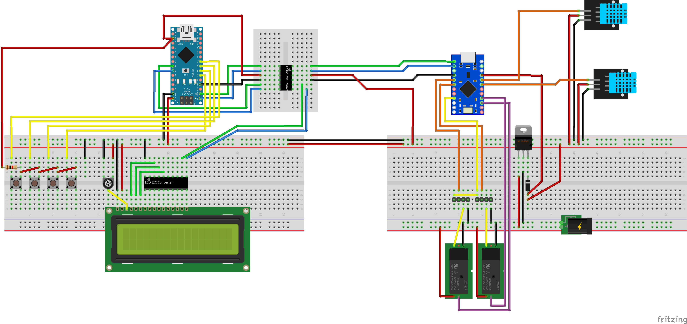
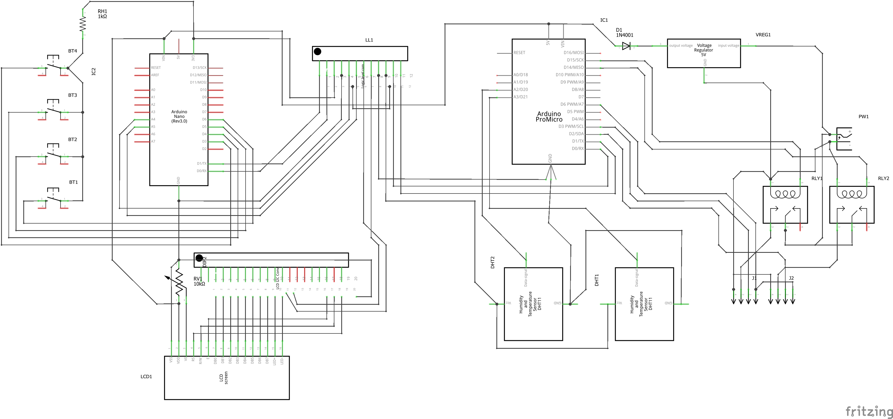

# FanControl_IOT - HMI Part

This is the part of the system that handle the interface to the user and the communication with the MQTT broker.

* Inputs:
	* Four push buttons
	* UART comm with the HMI part of the system

* Outputs:
	* LCD Display on i2c bus
	* MQTT client topic publishing

## Project Schema

