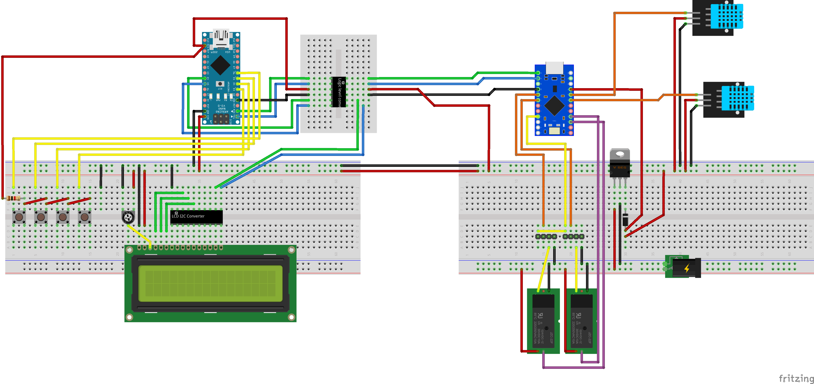
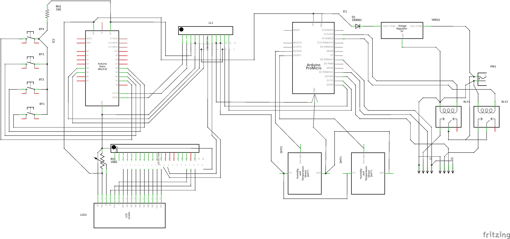

# FanControl_IOT - PLC Part

This is the part of the system that handle the two temperature sensors and the fans.

* Inputs:
	* Two Temperature sensors DHT11
	* RPM signal from the first fan

* Outputs:
	* One relay on the 12Vdc to fans
	* One PWM to the fans
	* UART comm with the HMI part of the system

## Project Schema

