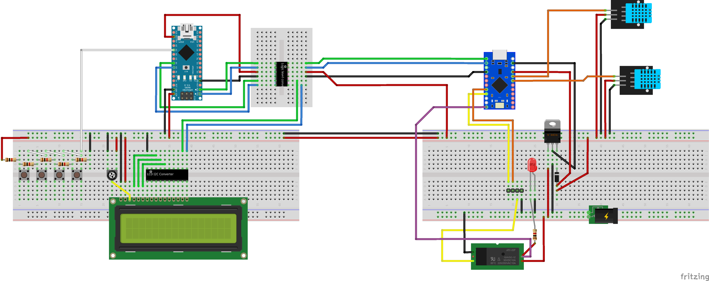
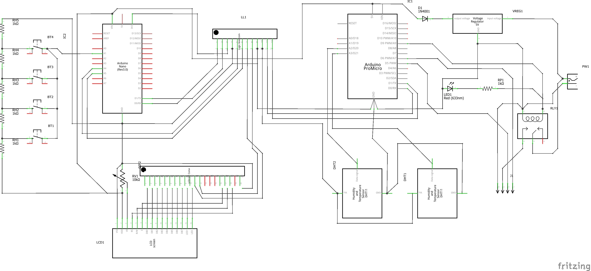

# FanControl_IOT
 
This is the evolution of an automatic temperature controller.
The controller consist of two Arduino compatible boards:
1. ProMicro clone (Atmel ATMega32U4) that read the temperature and control the 12Vdc fans.
2. Arduino Nano 33 IoT (Atmel ATSAMD21) that collect/visualize the data from the other board, and send that to a MQTT broker.

## Project Schema

